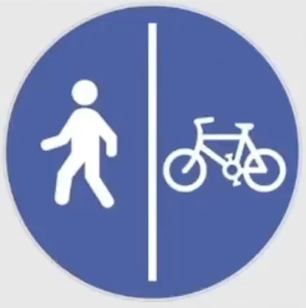
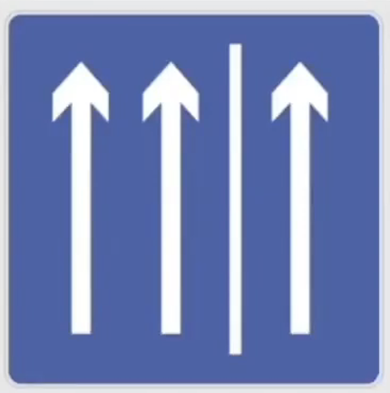
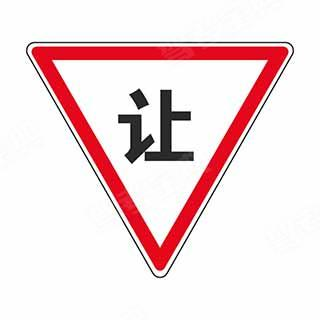
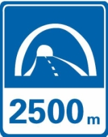
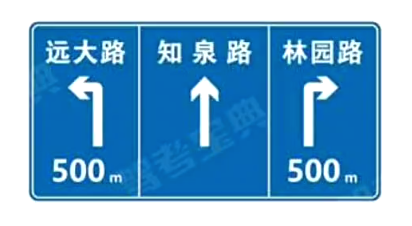
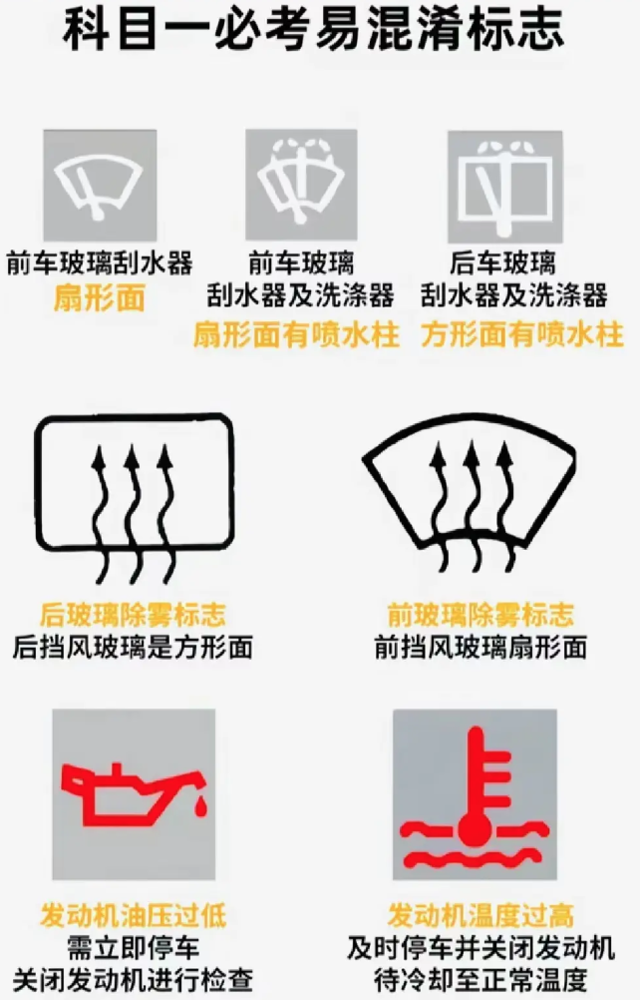

# 中国驾照学习

# 科目一

## 🔴驾证

不得考驾照时间：假 1 骗 3 毒 3 醉 5 逃罪终生（年）

其中：作弊 == 假；不正当 == 骗

驾照有效期：6/10/长期（年）

准驾车型：小车 18 岁无上限，过了 70 岁需每年体检。 AB 照需要每年体检。 C6 轻牵：C1C2 满一年，20-70。

戒毒满 3 年后，可以考 C1C2C5.

| 代号 | 车型         |
| ---- | ------------ |
| A1   | 大型客车     |
| A2   | 重型牵引挂车 |
| A3   | 公交车       |
| B1   | 中型客车     |
| B2   | 大型货车     |

换证：满 90 变 30 审 3（驾驶证期满 90 日前申请换证、信息变化 30 日内更新，因 兵役、出国 原因不能审验延期 3 年）

科二科三共 5 次机会，学习驾照 3 年有效，实习期内上高速需 3 年老司机。

年龄 20 考货车。

未满 12 分的学法减分，最多能减 6 分。

大中型客货车年龄不能超 63 周岁。

### 证件登记

**车登记、证随意**（只有驾驶证其余外其他的都是车的，比如号牌等）

1、<ins>驾驶证遗失、损毁需要补领！补领！</ins>——核发地，居住地，所在地，户籍地等。

2、<ins>颜色变、车架变、发动机<ins>要登记</ins></ins>；<ins>加防撞</ins>、不用登（除了防撞之外所有的“不登记”都是错的）

## 满分教育日期问题

只看红色就行，黑色不考。

|      | 现场（天）                     | 网络（天） | 自主（天） | 共计（天）                     |
| ---- | ------------------------------ | ---------- | ---------- | ------------------------------ |
| 小车 | 2 | 3          | 2          | 7 |
| 大车 | 5                              | 5          | 20         | 30                             |

注：每增加 12 分，小车加 7 天（最多 60 天），大车加 30 天（最多 120 天），但现场和网络天数不变。

满 12 分教育日期（参加科目一考试）

满 24-36 分（参加科目一、科目三考试）

满 36 分（参加科目一、科目二、科目三考试）

科目一：法律法规；

科目二场地，

科目三：道路驾驶技能

## 🔴扣分：

高速扣分：高逆 12、违停 9、应急 6、低速 3。

12 分【无视道德和法律，挑战交警底线】：轻伤死亡逃逸 12 分；伪造行驶证 12 分；代扣分；饮酒；

9 分【有犯罪想法】：校车无证就开；**故意遮挡号牌**；准驾不符；高城违停；中危车疲劳驾驶不足420；

6 分【警告不要知法犯法】：闯信号灯；**驾驶证被扣了还开**；**致人轻微伤或者财产损失事故后逃逸，尚不构成犯罪的**；危化品不挂标识、不按路线、不按时间开的。

3 分【不专心，可能有隐患】：玩手机；故障停车不用灯和标志；**不装号牌**；**普（通路）逆（行）**；高城不按车道；高城低于最低速度；乱借道超车、占道；三不让（让行 让人 让校车）；**公旅危车没安全检查**；货车疲劳驾驶不足420；

1 分【提醒驾驶人要注意安全】：**不按规定会车**、（不按规定使用）灯光、安全带、（摩托）不戴头盔、**违反禁令标志或线**、载货长宽高超标、擅自改变载货汽车就上路的、**普车没检查**

代扣牟利：3 倍 5 万 12 分。

ref: https://www.mps.gov.cn/n6557558/c8281723/content.html

### 🔴三超：超速、超员、超载

**超速9种**

| 车型   | 普路 |       | 高城 |       |
| :----- | :----------- | :---- | :----------- | :---- |
| 普通车 | 20-50%       | 3     | 20-50%       | 6     |
|        | 50%以上      | 6     | 50%以上      | 12    |
| 校中危 | 20-50%       | 6     | 20%以下      | 6     |
|        | 50%以上      | 9     | 20%以上      | 12    |
|        | 10-20%       | 1     |              |       |

**超员7种**

|         | 0-20% | 20-50% | 50%-100% | 100%以上 |
| :------ | :---- | :----- | :------- | :------- |
| 普通车  | 0     | 3      | 6        | 12       |
| 七上车  | 0     | 6      | 9        | 12       |
| 校公旅  | 6     | 12     | 12       | 12       |

**超载3种**

|      | 0-30% | 30-50%或载客 | 50%以上 |
| :--- | :---- | :----------- | :------ |
| 货车 | 1     | 3            | 6       |

- 超速：普（路）普（车）0/3/6，普校1/6/9。高普0/6/12，高校6/12/12吊。

高城超速只有6和12两档，没有9。

高校超速50%以上的，处二百元以上二千元以下罚款，可以并处吊销机动车驾驶证。

- 超员：7 下 3/6，7 上 6/9，100%扣 12 分。校20%以上就是12。

- 超载：1/3/6。30%以下 1 分，30%-50% 3 分，50%以上 6 分。

注意超载这里是从30%开始计分的。

ref: https://zhuanlan.zhihu.com/p/559382820

## 🔴扣留类

**扣留扣车选择题 5 种情况：6 个字**

**两证：** 驾驶证、行驶证

**两标：** 保险标志、检验合格标志

**一牌：** 车牌

---

<ins>看题目顺序：一罚二吊三拘役。</ins>

**扣留技巧判断题：**

只有两种情况错误，剩下的都对，

**错误情况：** 扣留行驶证❌ 没带身份证❌

饮酒扣留驾驶证 6 个月，并处 1000 以上，2000 以下罚款。饮酒被罚第二次，处十日以下拘留，并处**1000**以上**2000**以下罚款，吊销驾驶证。

超速 50%，吊销驾驶证，处 200 以上 2000 以下罚款。

学法教育中弄虚作假，撤销扣减记录，处**一千元**以下罚款。

拼装机动车，处**二百元**以上**二千元**以下罚款。

虚假材料申领驾照 500 元以下；1 年内不得再领。

洗毒是**注销**驾驶证。口诀：**注**射毒品。

**拘留技巧：**

跟钱在一起的拘留就是对的，没有钱的拘留就是错误的。

追逐竞驶，会拘役且处罚金，但不会判刑（没有判 3 年）！

---

**关于判刑：7 个字（拘役/刑/且/组织/因）**

出现重大事故致人重伤、死亡，3 年以下或者拘役

出现重大事故致人重伤、死亡且逃逸，3 年以上 7 年以下（申请人在机动车驾驶人考试过程中<ins>组织作弊</ins>的，情节严重构成犯罪）

出现重大事故因逃逸致人死亡的，7 年以上。

上路未携带驾驶证、行驶证的，除了扣车还要**罚款**。

**判刑技巧：**

1、有拘役优先选拘役，有拘役就对，遇到有期徒刑结尾的判断题为错
2、且 / (组织作弊) 找 3-7，因找 7 以上
组织作弊也找 3-7（新政增加）

---

## 事故类

**事故处理：**

1、<ins>有争议、有人受伤亡、有喝酒司机、有违法行为</ins>都是立刻报警（判断有报警 √）

2、<ins>无争议无人受伤亡</ins>（轻微刮擦等）<ins>撤离现场自行协商</ins>，不要影响交通，不要死等警察或者保险公司，警察来了会责令你撤离，并且罚款 200 元。

3、小型汽车驾驶人发生交通事故造成人员死亡，承担同等以上责任未被吊销驾驶证的，应当在记分周期结束后**30 日内**接受审验。

---

## 安全设备类

车辆偏离预警系统：LDW Lane Departure Warning System

## 安全驾驶类

驾驶机动车不得有下列行为：

熄火/空挡/惯性滑行；只要滑行就错

在机动车驾驶室的前后窗范围内**悬挂、放置妨碍驾驶人视线的物品**；

连续驾驶机动车超过 4 小时未停车休息或者停车休息时间少于 20 分钟；(420 法则)

---

冬季给电动汽车充电前，应提前预热电池。

电动车不能用**普通灭火器**

车辆涉水找间断轻踏、没有间断轻踏就找轻踏

## 驾驶规则类

<ins>持续/连续/长按喇叭</ins>都是错的，<ins>催促、逼迫、迫使、抢、占、保持原速</ins>的意思都是错误的。

**顺序通行三大原则：**

转弯让直行、右转弯让左转弯、同样直行让右侧先行

**不得超车情况有：** 超车只能从左侧

1. 前车正在左转弯、掉头、超车的；与对面来车有会车可能的；
2. 前车为执行紧急任务的警车、消防车、救护车、工程救险车的；
3. 特殊道路（行驶铁路道口、交叉路口、窄桥、弯道、陡坡、人行横道、市区交通流量大的路段等)没有超车条件的。（而且倒车停车）

---

1. **出现故障有四步：**
   - (1). 开启危险报警闪光灯，
   - (2). 移到不妨碍交通的地方，如果无法移动就继续第三步，
   - (3). 放置警告标志（普通道路 50-100 米之间，高速 150 米以外）
   - (4). 人下车去安全的地带（右侧路肩）报警等待救援
2. 超车只能从**左侧超车**（看到题目或图片说从右侧两侧超车直接错）
3. 超车时，如果无法保证与被超车辆的安全间距，应**主动放弃超车，停止超车**（遇到这两组词优先选，判断为正确）。
4. 道路没有划分机动车道、非机动车道和人行道的，
   **在道路中间通行**，给行人非机动车在两侧留有充足的空间，图片题。

---

**关于停车距离考点：**（口 5 站 3）

交叉路口、铁路道口、急弯路、窄路、桥梁、陡坡、隧道 50 米以内的路段，不得停车；

公共汽车站、急救站、加油站、消防栓或者消防队(站)门前以及距离上述地点 30 米以内不得停车；

**技巧：** <ins>只要没提站就找 50 有站就找 30</ins>

---

路权类：

1、驾驶机动车遇有前方交叉路口交通阻塞，或者看到图中堵车，我们只能<ins>依次排队在路口外</ins>，坚决不能进入路口。

（<ins>有依次、有顺序</ins>直接选，<ins>没有选路口外</ins>）

2、狭窄山路会车，<ins>靠山体的一方要让不靠山体的一方先行</ins>，环岛外的车<ins>让环岛内的车先行</ins>，<ins>有障碍的一方让无障碍的一方先行</ins>，<ins>辅路让主路先行</ins>。（主路车流大速度快）

3、看到<ins>随意通行、随意</ins>二字的或者看到说<ins>不用减速</ins>的题目都直接判断错误就可以（只有行人具有随意性的特点是正确的）

---

**车前方校车问题：**

两条车道 ，前方有校车停车来等待

三条车道，提前变道最左侧超越

## 灯光类

**近光灯：** 有车，有人，都需要，照明条件良好，隧道

**远光灯：** 照明条件不好，可以开。

（技巧：判断题开远光灯，使用远光灯都是错误的）

夜间会车需要**在 150 米前**关闭远光灯 / 使用近光灯。

**交替使用远近光灯：**

1.  超车（用于提醒前车）
2.  夜间特殊道路（举例：交叉路口，急转弯，人行横道等）
3.  用来提醒开启远光灯的人

机动车在夜间通过急弯、坡路、拱桥、人行横道或者没有交通信号灯控制的路口时（特殊道路），应当**交替使用远近光灯**。

<ins>（总结：夜间，非正常道路，交替使用远近；）</ins>

**技巧判断题：** 远近 √ 远、近 ×

---

**雾灯：** 只有雾天开雾灯，其他天气开都是错误的

<ins>危险报警闪光灯</ins>：1、临时停车 2、故障 3、雾天 4、牵引故障车

**左转向灯：** 只要有像左的动作，就得开。
（左转弯，掉头，超车，向左变道，进高速口）

**右转向灯：** 只要有像右的动作，就得开。
（右转弯，向右变道，靠边停车，出环岛，出高速口）高速右进右出，**但是环岛不一样，只有出需要开右**

---

## 标志类

### 交警的

1. 看到手心找停止通行
2. 两手伸直找直行
3. 捂住胸口(//回弯)找变道
4. 摸到伞柄找待转
5. 一只手一高一低找减速
6. 两只手一高一低找转弯看看哪个手在下面，就是哪个方向的转弯。

### 特殊的

停车：港湾式停靠站

粉三角牌是管理：交通事故管理

铁路道口：无人看守是机车，有人看守是栅栏，底部一条红线代表**50 米**。

一个山包叫减速丘；两个山包叫路面高低不平。

易混淆：小人过马路：绿、黄色三角牌是注意行人；蓝色车道指引牌是人行横道。

黄色三角牌，车在船上是”渡口“。

| 标志                          | 含义                                                                       |
| ----------------------------- | -------------------------------------------------------------------------- |
|  | 开车灯，不是近光灯                                                         |
|         | 行人与非机动车**分开空间**通行                                             |
|       | 硬路肩允许行驶路段开始。注意：直箭头是开始、箭头转弯是即将结束、红色是结束 |
|       | 禁止左转且**禁止掉头**                                                     |
|       | **减速让行！**                                                             |
|       | 隧道**出口**距离                                                           |
|       | 交叉路口预告                                                               |

雨刮器“前扇后长”。

---

## 速度类

城市的有线的同向一车道，限速 50。

| 线路     | 城市 | 城外 |
| -------- | ---- | ---- |
| 有中心线 | 50   | 70   |
| 无中心线 | 30   | 40   |

不 3 不 4，有 5 有 7。

驾驶机动车掉头、转弯、下陡坡时的最高速度不能超过每小时 30 公里。

科目一里**只要不是普通道路，特殊道路都是 30 公里/小时**

**【技巧：关于判断题中出现 XX 公里/小时，公里前面数字不是 30 或者 100 就是错的】**

### 高速速度类

**高速公路能见度、速度、距离的知识点总结口诀：**

261 --- 145 --- 52离

1、驾驶机动车在高速公路上行驶，遇低能见度气象条件时，能见度在200米以下时，车速不得超过每小时60公里，与同车道前车至少保持100米以上的距离。

2、驾驶机动车在高速公路上行驶，遇低能见度气象条件时，能见度在100米以下时，车速不得超过每小时40公里，与同车道前车至少保持50米以上的距离。

3、驾驶机动车在高速公路上行驶，遇低能见度气象条件时，能见度在50米以下时，车速不得超过每小时20公里，尽快驶离高速公路。

**高速上车道速度限制小口诀（三条车道）**

在对应车道的速度范围

| 左车道 | 中间车道 | 右车道 |
| ------ | -------- | ------ |
| 11-12  | 9-11     | 6-9    |

---

## ref

https://www.wolai.com/ustcse/kRQu3CMHcXhXAXj1aWNb4z
https://zhuanlan.zhihu.com/p/629844698
