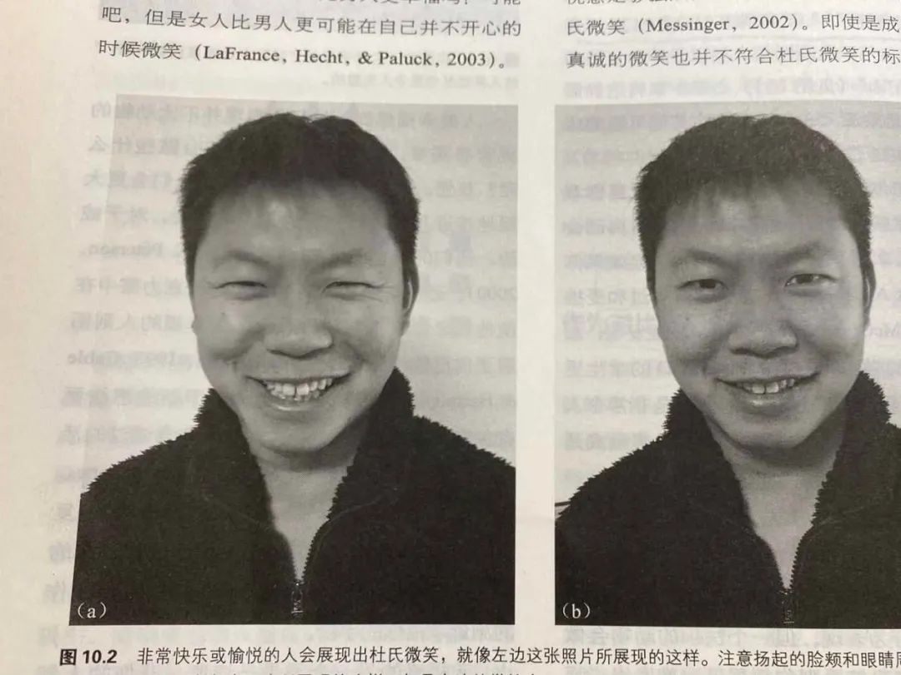

# 人际关系

## 肢体语言

要先设立基线，看看对方平时的语气、语调、瞳孔大小。

### 脸部

眼神（长时间）互相直视：有好感
眼神闪避（往出口看）：没兴趣
眼神瞇了一下：不赞同刚刚说的话（面试有用！）

假笑（社交型的笑）和真笑

> 我们的笑容，其实有两种，一种是真笑，另外一种是社交型的笑，那问题来了，怎么对这两种加以区分呢？
> 《情绪心理学》这本书提到这样的一个方法：提升的脸颊、眼角出现细纹，嘴巴会提升。（下图左边就是真笑，右边就是社交型的笑）

瞳孔放大：有好感
眉毛上扬：惊讶、怀疑、担心

嘴巴紧闭：紧张
抿嘴巴：不认同刚刚说的话（也不想讲出不认同的原因）
嘟嘴巴：怀疑你刚刚说的话
咬嘴唇：不信任你刚刚说的话
嘴巴上扬：有点轻蔑

### 其他

双手环抱、脚交叉：创建物理障碍、想要保持距离

重心向前：对讲话有兴趣

脚的朝向：朝向说话人-有好感；朝向出口-没兴趣。

对方是否在模仿你的动作：喝水、眼神方向 - 有好感

时钟效应（用来确定一个人是否在看你）：怀疑一个人在看你时，不要回头去直视，先看向另一个物体（比如挂钟），然后再看他的眼神，如果他在看挂钟，说明他在看你。

[約會、面試必修課！你必須知道的肢體語言](https://www.youtube.com/watch?v=tTPDv7TGvbA)

## 初次见面后的发展

### 先提大要求，再提小要求

鲁迅说过，中国人天性喜欢调合，如果你直接要求开窗，或许有人会不同意；但如果你说要把屋顶掀了，就有人同意开窗了。

因此可以试着提一个对方一开始就不会同意的请求，然后再提自己的小要求。

### 先让他人帮你一个小忙

应用[富兰克林效应](https://wiki.luoxufeiyan.com/doku.php?id=life:love#%E7%A4%BE%E4%BC%9A%E5%BF%83%E7%90%86%E5%AD%A6%E8%AF%B4)，对方在帮助你之后会做到[认知行为一致](https://wiki.luoxufeiyan.com/doku.php?id=life:love#%E8%AE%A4%E7%9F%A5%E7%9B%B8%E7%AC%A6%E7%90%86%E8%AE%BA_cognitve_consistency_theory)，从而改变对你的印象。

### 经常露脸，刷存在感

> 心理学家很早就发现，人对于某件事物越是熟悉，就会越喜欢它，即使这件事物，是负面消极的，人也会觉得亲切和没有威胁性。
> 要不然，为什么有很多人，沉溺在痛苦、悲伤的情绪之中？

[分享一些对我很有用的心理学小知识 曾少贤](https://mp.weixin.qq.com/s?__biz=MzI1MzUzNTc0NQ==)

## 聊天话题

