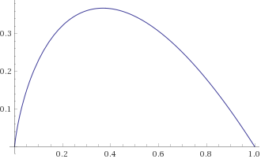

# 恋爱观

## 爱情的原因

### 社会心理学说

富兰克林效应：那些曾帮你一次忙的人，将比那些你曾经帮助过的人，更愿意帮你。

## 恋爱交往

### 认知相符理论（Cognitve Consistency Theory）

当别人帮了你一个忙之后，对方会在想为什么会帮你，从而调整自己认知，改变你在他心中的印象。

> 认知相符理论（Cognitve Consistence Theory）是以认知趋向一致的状态或倾向性来解释个人心理活动和外部行为变化的社会心理学理论。认知相符概念早先是由美国心理学家W.J.麦克盖尔提出的。麦克盖尔认为，人有一种动力倾向性，其信念、观点或态度如果与其他观点或行为有矛盾，只要他意识到，他就会自发地去调整自己原来的观点，去与正常逻辑关系相符。这种认知相符倾向的观点是把人作为理智人的见解。在这一共同思想的基础上，许多社会心理学家展开了大量研究，形成了各自的理论，并统称为认知相符理论。

[认知相符理论 - MBA智库百科](https://wiki.mbalib.com/wiki/%E8%AE%A4%E7%9F%A5%E7%9B%B8%E7%AC%A6%E7%90%86%E8%AE%BA)

## 关系强迫行为

怀疑对方是否爱自己。

**关系强迫行为**（Relationship Obsessive-Compulsive Disorder）是指在亲密关系中（不限于情侣关系）的一些强迫性思想（执念）或者行为。

ref: https://www.zhihu.com/question/23932312/answer/456102799

## 表达爱

Gary Chapman认为爱有5种语言，以下这5种都是表达爱方式：

-   **肯定的话语** words of affirmation：一句温暖的话语、卡片或者书信
-   **肢体接触** physical touch：拥抱、亲吻、摸头杀
-   **支持行为** acts of service：帮忙分担家务、为对方做些事情
-   **交换礼物** receiving gifts：包括特殊节日的礼物，或者一个小的信物
-   **共处时间** quality time：不仅是空间上在一起，并且双方共同进行一项活动，有真正的互动

  
  
作者：简单心理  
链接：https://www.zhihu.com/question/23932312/answer/456102799  
来源：知乎  
著作权归作者所有。商业转载请联系作者获得授权，非商业转载请注明出处。

## 情侣相处时更要共同探索更大的世界

不要因为表白成功就选择安逸，放弃成长。共同成长才能更好理解。

自我扩张模型（self-expansion model）

### 反馈

恋爱上注意`物质`和`精神`反馈必需至少有一个。陪伴，哄对方开心是一种奖励，精神反馈。

## 区别喜欢和爱情

喜欢是一种欣赏和认同，爱情可以由喜欢进化而来，但爱情是独占（别人不能喜欢），喜欢不是。

根据社会心理学，只有爱情会依恋、利他、亲密。

### 依恋

>卷入爱情的双方在感到孤独时，会高度特异性地去寻找对方来伴同和安慰，而喜欢的对象不会有同样的作用。

依恋的常见四种类型，不同依恋类型形成，受儿童时期成长环境、早期教养方式和情感史三方面影响。

1. 安全型：“我在这里，哪儿也不会走，你来，我招待；你走，我欢送。”
2. 倾注型：“我需要你，如果你不在，我要怎么活？可是哪怕我再烦，你在我身边我都觉得还可以接受。”
3. 轻视型：“如果我心情好，可以考虑接见你，但是如果我不想见到你，你就少来烦我！”
4. 害怕型：“如果我想你出现，你却不在，那么我就不愿意相信你了；我不想你在我身边的时候，你就最好不要在我的视线范围中。”

### 利他
> 恋爱中的人会高度关注对方的情感状态，觉得让对方快乐幸福是自己义不容辞的责任。在对方有不足时，也会表现出高度的宽容。最自我中心、自私自利的人，在恋爱中也会表现出某种理解、宽容、关爱和无私。

### 亲密

> 恋爱的双方不仅对对方有高度的情感依赖，而且会有身体接触的需求。性是爱情的基础，是爱情的核心部分。
> 
> 罗伯特·斯坦伯格(Robert J·Sternberg)提出的爱情三角理论(Triangular theory of love)，认为爱情由三个基本成分组成：激情、亲密和承诺。激情是爱情中的情欲成分，是情绪上的着迷；亲密是指在爱情关系中能够引起的温暖体验；承诺指维持关系的决定期许或担保。

## 如何选择对的人

* 麦穗理论(最优停止理论)

柏拉图麦穗理论、秘书问题，最优解：1/3样本区间、2/3备选区间

P = -xln(x)

* 纽约时报十五问：纽约时报婚前15个问题

## 两性

性教育： 17ID-019 《三十岁的保健体育》（30歳なのに保健体育）

## 参考

* 郭永玉. 人格心理学[M]. 北京: 中国社会科学出版社, 2005.
* [vol.142 『试播』李大夫夜话 · 初恋的味道  津津乐道播客](https://jinjinledao.org/?p=905)
* [社会心理学中, 爱情与喜欢区别的主要表现](https://www.jianshu.com/p/9940552bff29)
* [心理学（第8版）豆瓣笔记](https://book.douban.com/annotation/35378276/)