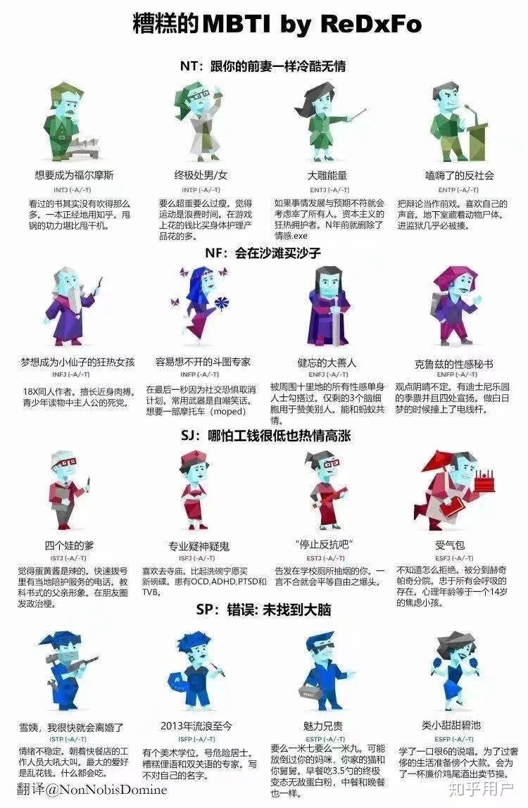

# MBTI性格分类法

迈尔斯-布里格斯性格分类法

| 类别     |                       |                       |
|----------|-----------------------|-----------------------|
| 能量来源 | 外向型 (Extraversion) | 内向型 (Introversion) |
| 感知偏好 | 实感型 (Sensing)      | 直觉型 (iNtuition)    |
| 判断偏好 | 思考型 (Thinking)     | 情感型 (Feeling)      |
| 认知态度 | 判断型 (Judging)      | 感知型 (Perceiving)   |

来源：[迈尔斯-布里格斯性格分类法 - 维基百科，自由的百科全书](https://zh.wikipedia.org/wiki/%E9%82%81%E7%88%BE%E6%96%AF-%E5%B8%83%E9%87%8C%E6%A0%BC%E6%96%AF%E6%80%A7%E6%A0%BC%E5%88%86%E9%A1%9E%E6%B3%95)

S:客观事实
N：主观观点，更倾向于抽象和想像。

![](mbti_relation_between_types.png]]

## 应用

S：生活类：美食、电影、游戏、旅游

N：宇宙、哲学、历史……

## others
[[holland_hexagon]]