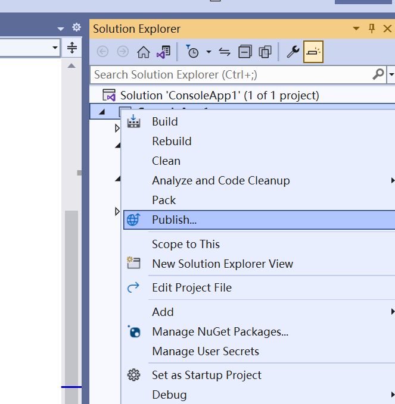
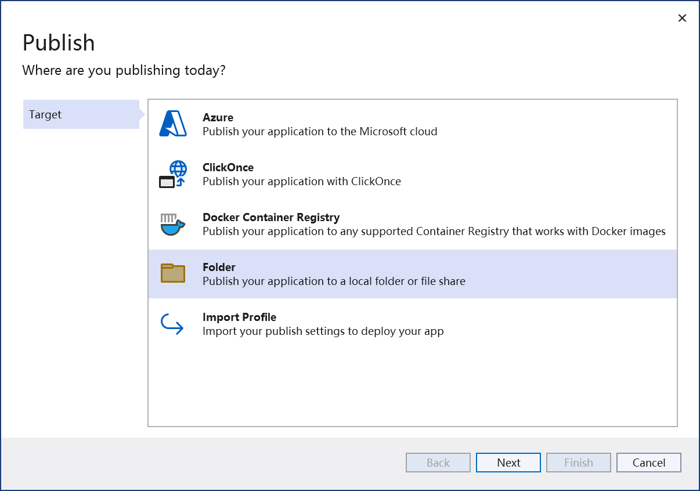
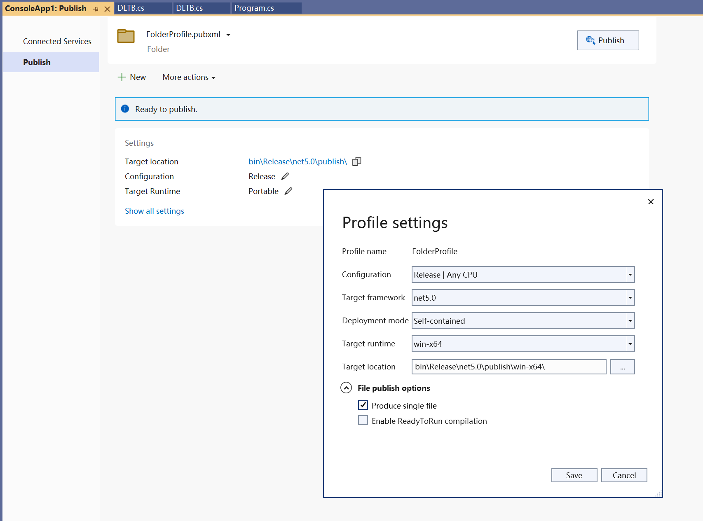

# 打包为单文件

将 .NET 工程打包为一个单文件的 exe ，以便于在其他设备上运行。

修改 csproj 文件如下：

```c#
<Project Sdk="Microsoft.NET.Sdk">

  <PropertyGroup>
    <OutputType>WinExe</OutputType>
    <TargetFramework>net6.0-windows</TargetFramework>
	<PublishSingleFile Condition="'$(Configuration)' == 'Release'">true</PublishSingleFile>
	<SelfContained>true</SelfContained>
	<RuntimeIdentifier>win-x64</RuntimeIdentifier>
	<PublishReadyToRun>true</PublishReadyToRun>

    <IncludeNativeLibrariesForSelfExtract>true</IncludeNativeLibrariesForSelfExtract>
  </PropertyGroup>
</Project>
```

打包为单文件时，**必须**指定目标系统和处理器架构，每一个目标平台（Linux x64, Linux Arm64, Windows x64）都需要单独的修改配置文件。

各参数含义如下：

* `PublishSingleFile`: 启用单文件发布。开启后，在 buuild 时会产生一条 warning 。
* `SelfContained`: 启用后为 SelfContained 模式，程序运行不依赖 .NET 运行时；否则为 Framework-dependent 模式，程序仍依赖运行时。
* `RuntimeIdentifier`: 指定目标设备的系统和处理器架构。[可取值有这些](https://docs.microsoft.com/en-us/dotnet/core/rid-catalog)
* `PublishReadyToRun`: 启用AOT编译。
* `IncludeNativeLibrariesForSelfExtract`: 把系统库（比如： CoreCLR）也打包到单文件中，禁用的话会生成出一些系统库的dll和pdb，[ref](https://stackoverflow.com/questions/65170327/net-5-publish-single-file-produces-exe-and-dlls)。但会导致下面的这个 .NET 6 项目的问题。

注意， `.NET 6` 项目在设置 `PublishSingleFile` 时会遇到在Debug模式下不能编译的[Bug](https://github.com/dotnet/runtime/issues/45382)，需要将这一条设置为仅在 Release 模式下启用单文件打包。

`<PublishSingleFile Condition="'$(Configuration)' == 'Release'">true</PublishSingleFile>`

## 打包方法

1. 在项目上右键选择发布。


2. 选择发布到时文件夹。


3. 在设置中选择 Deployment mode, Target runtime, Target runtime。点击发布按钮发布。



### ref

* [Create a single file for application deployment - .NET | Microsoft Docs](https://docs.microsoft.com/en-us/dotnet/core/deploying/single-file/overview?tabs=cli)
* [dotnet publish command - .NET CLI | Microsoft Docs](https://docs.microsoft.com/en-us/dotnet/core/tools/dotnet-publish)