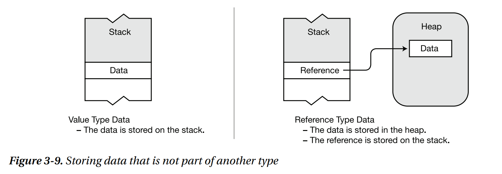

# 类型、存储与变量 types storage and variables

## 值类型和引用类型

值类型包括大多数定长的内置类型（比如 int, short, float, bool, ）和 struct, enum 。

引用类型大多数为不定长，比如 string, object, array, class, interface ...

* 值类型数据存储在栈里。
* 对于引用类型数据，数据引用存储在栈里，数据本身存储在堆里。

ref: 
* Illustrated C# 2012 (Expert's Voice in .NET) [Solis, Daniel]
* [Types - C# language specification | Microsoft Docs](https://docs.microsoft.com/en-us/dotnet/csharp/language-reference/language-specification/types#value-types)