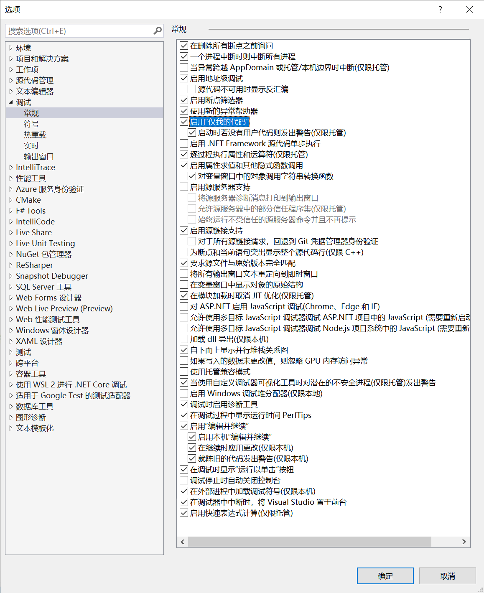
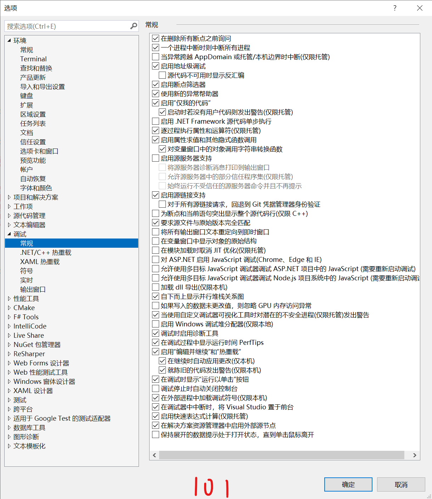

# Visual Studio for C#


## 解决编译时偶发的无法调试但可以运行的问题

运行项目时，有时会遇到无法调试但可以正常运行的问题。不同计算机下的相同开发环境不能复现这个问师，大概率与编译器有关。

表现为开始调试某时刻开始出现 `System.TypeLoadException` 问题。


```log
Udp<10.243.80.28:9002-0.0.0.0:0>: Information: OpenFailed
Udp<0.0.0.0:0-0.0.0.0:0>: Information: Opening
Udp<0.0.0.0:0-0.0.0.0:0>: Information: Opened
引发的异常:“System.Reflection.ReflectionTypeLoadException”(位于 System.Private.CoreLib.dll 中)
引发的异常:“System.MissingMethodException”(位于 System.Private.CoreLib.dll 中)
引发的异常:“System.MissingMethodException”(位于 System.Private.CoreLib.dll 中)
Udp<***.***.56.43:40002-***.***.56.33:40103>: Information: Opening
Udp<***.***.56.43:40002-***.***.56.33:40103>: Information: Opened
“MAIN_FUNC.exe”(CoreCLR: clrhost): 已加载“D:\...\Microsoft.IO.RecyclableMemoryStream.dll”。
TcpClient<***.***.72.49:9000-***.***.79.199:9000>: Error: ConnectCompleted Error

System.Net.Sockets.SocketException (10061): 由于目标计算机积极拒绝，无法连接。
TcpClient<***.***.72.49:9000-***.***.79.199:9000>: Information: OpenFailed
引发的异常:“System.TypeLoadException”(位于 MediatR.dll 中)
引发的异常:“System.AggregateException”(位于 NBus.dll 中)
引发的异常:“System.TypeLoadException”(位于 MediatR.dll 中)
引发的异常:“System.AggregateException”(位于 NBus.dll 中)
引发的异常:“System.TypeLoadException”(位于 MediatR.dll 中)
引发的异常:“System.AggregateException”(位于 NBus.dll 中)
引发的异常:“System.TypeLoadException”(位于 MediatR.dll 中)
```

随后是通篇的“引发的异常”。

### 解决方法

在VS选项-调试-常规中：

* 勾选：在模块加载时取消JIT优化。（Suppress jit optimization on module load）
* 勾选：启用“仅我的代码” 【也可能有帮助】
* 不勾：使用托管兼容模式（Use Managed compatibility mode）


最后可以正常调试的VS配置如下：


#### VS 2019




#### VS 2022




### ref

* https://developercommunity.visualstudio.com/t/cannot-run-in-debug-mode/281320