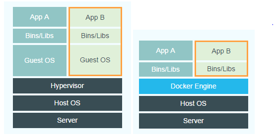

# Docker
[[ https://yeasy.gitbooks.io/docker_practice/content/compose/|Docker —— 从入门到实践]]

## 综述

### Docker与虚拟机的区别

**Docker不是虚拟机！**




[[https://www.zhihu.com/question/48174633/answer/180743885|知乎 - docker容器与虚拟机有什么区别？]]


## 容器
按照 Docker 最佳实践的要求，容器不应该向其存储层内写入任何数据，容器存储层要保持无状态化。所有的文件写入操作，都应该使用 数据卷（Volume）、或者绑定宿主目录，在这些位置的读写会跳过容器存储层，直接对宿主(或网络存储)发生读写，其性能和稳定性更高。
数据卷的生存周期独立于容器，容器消亡，数据卷不会消亡。因此，使用数据卷后，容器可以随意删除、重新 run，数据却不会丢失。

### 虚悬镜像(dangling image)
虚悬镜像已经失去了存在的价值，是可以随意删除的，可以用下面的命令删除。

容器运行交互式命令需要加 -it


其中：

--t:在新容器内指定一个伪终端或终端。

--i:允许你对容器内的标准输入 (STDIN) 进行交互。

### 构建镜像Dockerfile

COPY 这类指令中的源文件的路径都是相对路径。这也是初学者经常会问的为什么 `COPY ../package.json /app` 或者 `COPY /opt/xxxx /app` 无法工作的原因，因为这些路径已经超出了上下文的范围，Docker 引擎无法获得这些位置的文件。如果真的需要那些文件，应该将它们复制到上下文目录中去。


## 常用命令

### 进入容器

`docker exec -it CONTAINER_NAME bash`


## 配置

### 为 Docker 配置代理

Systemd 模式：

如果 Docker 是通过 systemd 的方式启动管理的，可以通过以下方式配置代理：

新建 `/etc/systemd/system/docker.service.d/10_docker_proxy.conf` 文件：

```shell

[Service]
Environment=HTTP_PROXY=http://10.243.80.87:8228
Environment=HTTPS_PROXY=http://10.243.80.87:8228

```

填入 代理信息后，重启。

```shell
sudo systemctl daemon-reload
sudo systemctl restart docker
```

ref: [Configure the daemon with systemd | Docker Docs](https://docs.docker.com/config/daemon/systemd/)
