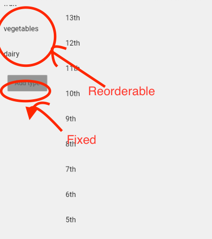

# 控件


### 底部按钮 FAB

可用`floatingactionbutton`实现，遵循Material design规范。


改变位置用`floatingActionButtonLocation`，写在`floatingActionButton `之外。

改变形状可用`shape`属性，默认为`CircleBorder()`，例如改变为矩形按钮：

```dart
floatingActionButton: FloatingActionButton(
  onPressed: () {},
  child: Icon(Icons.add,),
  shape: RoundedRectangleBorder(),
),
```

为按钮添加边框：

```dart
floatingActionButton: FloatingActionButton(
          onPressed: () {},
          child: Icon(Icons.add),
          shape: CircleBorder(
              side: BorderSide(color: Color(0xff5352ec), width: 4.0)),
        ),
```

设置前&后景色：

```dart
floatingActionButton: FloatingActionButton(
          onPressed: () {},
          child: Icon(Icons.add),
          backgroundColor: Colors.white, //背景色
          foregroundColor: Color(0xff5352ec), //高亮色
          shape: CircleBorder(
              side: BorderSide(color: Color(0xff5352ec), width: 4.0)), //边框色
        ),
```

## 展开菜单 speed dial


```dart
import 'package:flutter/material.dart';
import 'dart:math' as math;

void main() {
  runApp(new MyApp());
}

class MyApp extends StatelessWidget {
  @override
  Widget build(BuildContext context) {
    return new MaterialApp(
      home: new MyHomePage(),
    );
  }
}

class MyHomePage extends StatefulWidget {
  @override
  State createState() => new MyHomePageState();
}

class MyHomePageState extends State<MyHomePage> with TickerProviderStateMixin {
  AnimationController _controller;

  static const List<IconData> icons = const [ Icons.sms, Icons.mail, Icons.phone ];

  @override
  void initState() {
    _controller = new AnimationController(
      vsync: this,
      duration: const Duration(milliseconds: 500),
    );
  }

  Widget build(BuildContext context) {
    Color backgroundColor = Theme.of(context).cardColor;
    Color foregroundColor = Theme.of(context).accentColor;
    return new Scaffold(
      appBar: new AppBar(title: new Text('Speed Dial Example')),
      floatingActionButton: new Column(
        mainAxisSize: MainAxisSize.min,
        children: new List.generate(icons.length, (int index) {
          Widget child = new Container(
            height: 70.0,
            width: 56.0,
            alignment: FractionalOffset.topCenter,
            child: new ScaleTransition(
              scale: new CurvedAnimation(
                parent: _controller,
                curve: new Interval(
                  0.0,
                  1.0 - index / icons.length / 2.0,
                  curve: Curves.easeOut
                ),
              ),
              child: new FloatingActionButton(
                heroTag: null,
                backgroundColor: backgroundColor,
                mini: true,
                child: new Icon(icons[index], color: foregroundColor),
                onPressed: () {},
              ),
            ),
          );
          return child;
        }).toList()..add(
          new FloatingActionButton(
            heroTag: null,
            child: new AnimatedBuilder(
              animation: _controller,
              builder: (BuildContext context, Widget child) {
                return new Transform(
                  transform: new Matrix4.rotationZ(_controller.value * 0.5 * math.pi),
                  alignment: FractionalOffset.center,
                  child: new Icon(_controller.isDismissed ? Icons.share : Icons.close),
                );
              },
            ),
            onPressed: () {
              if (_controller.isDismissed) {
                _controller.forward();
              } else {
                _controller.reverse();
              }
            },
          ),
        ),
      ),
    );
  }
}
```

ref:[dart - Flutter floating action button with speed dial - Stack Overflow](https://stackoverflow.com/a/46480722)

#### ref

* 文档[Floating action button - Material Design](https://material.io/develop/flutter/components/floating-action-buttons)
* 教程（推荐）[A Deep Dive Into FloatingActionButton in Flutter | by Deven Joshi | ProAndroidDev](https://proandroiddev.com/a-deep-dive-into-floatingactionbutton-in-flutter-bf95bee11627)


### 拖动列表

可以通过`ReorderableListView`实现可拖动的列表。


注意所有的children都必须有`key`属性。`ReorderableListView`本身需要被`Expanded()`包裹。

```dart
Widget FruitMenuList() {
    return ReorderableListView(
      scrollController: _fruitCtl,
      children: [
        for (final f in fruitlist) // User defined objects
          ListTile(
            key: ValueKey(f.categoryId),
            title: Text('${f.categoryName}'),
          )
      ],
      onReorder: (oldIndex, newIndex) {
        print('oldIndex: $oldIndex , newIndex: $newIndex');
        setState(() {
          if (newIndex == fruitlist.length) {
            newIndex = fruitlist.length - 1;
          }
          var item = fruitlist.removeAt(oldIndex);
          fruitlist.insert(newIndex, item);
        });
      },
    );
```

实现底部固定按钮（上部分列表可移动，下部分按钮独立）：




例如：

```dart
Widget marketTypeList() {
    return Column(
      mainAxisAlignment: MainAxisAlignment.start,
      mainAxisSize: MainAxisSize.max,
      children: [
        Flexible(
          flex: 3,
          child: ReorderableListView(...),
        ),
        Flexible(
          flex: 3,
          child: RaisedButton(onPressed: null, child: Text("Add type")),
        ),
        Flexible(flex: 6, child: Container())
      ],
    );
  }
```


### 嵌套 ListView的滚动条


出现`ListView`嵌套时，实现同一滚动条的效果，可以在子级的`ListView`中设置`physics: ClampingScrollPhysics(),`，实现子级滚动条复用上级的滚动条。

同样，不希望 ListView 滚动时，可以添加`physics: NeverScrollableScrollPhysics(),` 实现不能滚动的效果。[ref](https://stackoverflow.com/questions/50477809/flutter-listview-disable-scrolling-with-touchscreen)


Ref: 

* [ReorderableListView class - material library - Dart API](https://api.flutter.dev/flutter/material/ReorderableListView-class.html)
* [Building a Top Ten List: Using ReorderableListView to Reorder List Items](https://developer.school/building-a-top-ten-list-using-reorderablelistview-to-reorder-list-items/)

### 全屏幕加载进度条

`ModalProgressHUD`：[modal_progress_hud | Flutter Package](https://pub.dev/packages/modal_progress_hud)

例如：

```dart
body: ModalProgressHUD(
          child: SingleChildScrollView(
            child: Container(),
          ),
          inAsyncCall: _isInAsyncCall,
          opacity: 0.5,
          progressIndicator: CircularProgressIndicator(),
        ),
```

可以在`isInAsyncCall`时进入加载动画。


### 计数器


[dart - Counter widget in flutter - Stack Overflow](