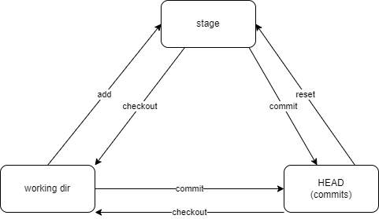
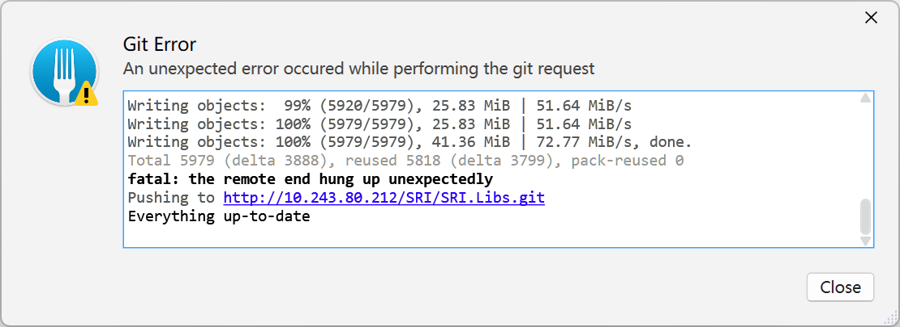

# Git

- `--local` : 为每一个 repo 设立不同的 config。文件会被放在 .git/config 中，只对当前 repo 有效。
- `--global` : 设置为全局，对所有仓库生效。

设置用户：

```shell
git config --local user.name "Hugh Gao"
git config --local user.email "admin@luoxufeiyan.com"
```

Git 状态

Git 的三个分区： working directory, stage area (index area), HEAD (commits).

- working directory 指的是文件夹中实际能看到的文件。
- stage 指的是通过 `add` 命令添加进入的暂存区。
- HEAD 是当 stage 存在修改时，通过 `commit` 命令添加进入的 Git 历史区，自此修改会被 Git 存档。HEAD 指的是 Git 的 `HEAD` 指针指向的位置。

working directory 与 stage 的改动可以通过 `git status` 命令查看， HEAD 的改动可以通过 `git log` 查看。

状态转移图：



ref: [我用四个命令概括了 Git 的所有套路 :: labuladong 的算法小抄](https://labuladong.github.io/algo/di-si-zhan-4baf4/wo-yong-si-ad48a/)

## 新建与克隆

### Proxy 代理

为 git 设置代理，可以通过 `git config` 命令设置。 Git 支持多种代理，包括 http, https, socks4, socks5 等。

为全局设置 http 代理：

```shell
git config --global http.proxy http://127.0.0.1:8118
```

为单独仓库设置 socks 代理，需要先切换到仓库目录下：

```shell
git config --local http.proxy socks5h://127.0.0.1:1080
```

在克隆时使用代理，仅需在克隆命令后加 ` --config "http.proxy=socks5h://127.0.0.1:1080"` 。 例如：

```shell
git clone https://chromium.googlesource.com/chromium/tools/depot_tools.git --config "http.proxy=socks5h://127.0.0.1:1080"
```

为特定的某个 remote 设置代理（以 GitHub 为例）：

```shell
git config --global http.https://github.com.proxy "socks5://127.0.0.1:1080"
```

本地：

```shell
git config --global http.http://10.243.80.212.proxy "http://10.1.100.88:8118"
```

取消代理：

```shell
git config --local --unset http.proxy
```

在国内加速访问 GitHub 的方式可以参考：[[2022.03] GitHub 加速终极教程](https://hellodk.cn/post/975)

#### SSH 连接 Git

1. 启用身份验证

   ```
   ssh-agent bash
   ```

2. 添加密钥

- 仅限当前会话：
  `ssh-add ~/.ssh/id_key`
- 持久化：（保存到 ssh 的配置文件中）

      编辑`vim ~/.ssh/config`文件，添加以下：

```
Host github.com
    User git
    IdentityFile ~/.ssh/GitHub/GitHub_id_rsa
```

- 测试

```
ssh -T git@github.com
```

### 添加远程仓库

```shell
git remote -v
git remote remove origin
git remote add origin git@github.com:user/repo.git
```

## 小抄速记

### Cherry pick 从某一分支拉取特定的 commit 文件

合并所有 commit 可以用`git merge`，当只需要特定的 commit 时，可以用`cherry pick`。

用法：

```shell
git cherry-pick <commitHash>
```

### 撤销远程修改

即便 commit 已经推送到远程，依然可以用 revert 的方法将远程的提交删除。

### 撤销本地的最后一次 commit

```shell
git reset --hard HEAD~1
```

### 常用查询

查询仓库总代码量：

```sh
git ls-files | xargs wc -l | tail -n 1
```

查询最近一年的代码变化行数：

```sh
git log --since="1 year ago" --numstat | awk '/^[0-9]+/ { added += $1; deleted += $2 } END { printf("Added lines: %s\nDeleted lines: %s\n", added, deleted) }'
```

查询作者对仓库的修改行数：

```sh
git log --author="Hugh Gao" --pretty=tformat: --numstat | awk '{ add += $1; subs += $2 } END { printf "added lines: %s\nremoved lines: %s\ntotal lines: %s\n", add, subs, add - subs }'
```

查询一段时间内，各作者提交的行数：

```sh
git log  --format='%aN' | sort -u | while read name; do echo -en "$name\t"; git log --author="$name" --pretty=tformat:  --since =2018-02-08 --until=2024-03-08 --numstat | awk '{ add += $1; subs += $2; loc += $1 - $2 } END { printf "added lines: %s, removed lines: %s, total lines: %s\n", add, subs, loc }' -; done
```

查询某个分支上的提交数量：

```sh
git rev-list --count <branch-name>
```

## [Conventional Commits](https://www.conventionalcommits.org/en/v1.0.0/)

git 常用编写

- feat: 添加新特性、新功能 (feature)
- fix: 修复 bug
- docs: 仅仅修改了文档
- style: 仅仅修改了空格、格式缩进、逗号等等，不改变代码逻辑
- refactor: 代码重构，没有加新功能或者修复 bug
- perf: 增加代码进行性能测试
- test: 增加测试用例
- chore: 改变构建流程、或者增加依赖库、工具等

### [Conventional Commits 的优点](https://www.conventionalcommits.org/en/v1.0.0-beta.2/#why-use-conventional-commits)

- 自动生成变更日志。
- 自动确定不同功能版本升级（基于提交类型的）。
- 将更改的性质传达给协作成员。
- 触发构建和发布流程。
- 把仓库的提交历史变的更结构化。

相关工具：

- [conventional-changelog/commitlint: 📓 Lint commit messages](https://github.com/conventional-changelog/commitlint)
- [conventional-changelog/conventional-changelog: Generate changelogs and release notes from a project's commit messages and metadata.](https://github.com/conventional-changelog/conventional-changelog)

## GPG Sign

为 Git 提交添加 GPG 签名。

1. 列出当前本机上的所有私钥。

```shell
gpg --list-secret-keys --keyid-format=long
```

结果如下：

```shell
/Users/hubot/.gnupg/secring.gpg
------------------------------------
sec   4096R/3AA5C34371567BD2 2016-03-10 [expires: 2017-03-10]
uid                          Hubot <hubot@example.com>
ssb   4096R/4BB6D45482678BE3 2016-03-10
```

2. 选择提交所使用的密钥，如上的 `3AA5C34371567BD2`。

```shell
git config --global user.signingkey 3AA5C34371567BD2
```

3. 设置提交时默认进行 commit 签名。

```shell
git config --global commit.gpgsign true
```

ref: [https://docs.github.com/en/authentication/managing-commit-signature-verification/telling-git-about-your-signing-key](https://docs.github.com/en/authentication/managing-commit-signature-verification/telling-git-about-your-signing-key)

### tips

如果你使用的某些 Git 客户端使用了 GitBash （例如 git-fork），且你使用了 GPG 程序（例如 GPG4Win 或者 Kleopatra）来管理密钥的话，GitBash 中的 gpg 路径可能未正确的指向 GPG 的程序，导致找不到密钥。

这种情况下，需要指向自定义的 GPG 程序。

```shell
git config --global gpg.program "/c/Program Files (x86)/GnuPG/bin/gpg.exe"
```

或者手动配置 gitconfig 文件：

```gitconfig
[gpg]
    program = C:\\Program Files (x86)\\GnuPG\\bin\\gpg.exe
    format = openpgp
[commit]
    gpgsign = true
```

ref: [https://gist.github.com/BoGnY/f9b1be6393234537c3e247f33e74094a](https://gist.github.com/BoGnY/f9b1be6393234537c3e247f33e74094a)


## FAQ

### 解决因推送体积过大而失败的问题

推送时，出现以下问题：




```log
Enumerating objects: 5979, done.
Counting objects:   0% (1/5979)
Counting objects:   1% (60/5979)
......
Writing objects:  99% (5920/5979), 25.83 MiB | 51.64 MiB/s
Writing objects: 100% (5979/5979), 25.83 MiB | 51.64 MiB/s
Writing objects: 100% (5979/5979), 41.36 MiB | 72.77 MiB/s, done.
Total 5979 (delta 3888), reused 5818 (delta 3799), pack-reused 0
fatal: the remote end hung up unexpectedly
Pushing to http://MyAddr/repo.git
Everything up-to-date
```

问题原因是当前 git 设置的 HTTP POST 包体长度过大。

解决方法：

```shell
git config http.postBuffer 524288000
```

ref: [github - Git, fatal: The remote end hung up unexpectedly - Stack Overflow](https://stackoverflow.com/a/15851500/3886059)


如果修改了客户端的配置，问题仍然存在，且变成了 HTTP 413 ERROR，表示服务端的 HTTP Server 不支持过大的 POST 请求，一般是 HTTP Server + reverse proxy + git Server 的情况。

问题表现：

```log
error: RPC failed; result=22, HTTP code = 413
fatal: The remote end hung up unexpectedly 
fatal: The remote end hung up unexpectedly
```

需要修改 HTTP Server 的设置，把 POST 设置为一个较大的值。

ref: [git - Github Push Error: RPC failed; result=22, HTTP code = 413 - Stack Overflow](https://stackoverflow.com/a/15021750/3886059)


## Links

- [Git alias](https://gist.github.com/hutusi/e4f32e2bcd8d53ec86de8254ab0d5127)
- [Oh Shit, Git!?! 在使用 git 时的一些尴尬场景里的修复方案](https://ohshitgit.com/)
- [Flight rules for Git Git 飞行手册](https://github.com/k88hudson/git-flight-rules)
