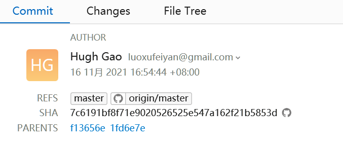

# Merge

## fast forward merge 快进式合并

当你的当前分支（新特性分支，newFeature）上的改动是基于目标分支（主分支，master）的**最新版本**的情况下，Git 默认使用 fast forward merge 来合并。因为主分支上并没有后续修改。

场景：

1. 你在一个特性分支上进行了修改，这段时间内 master 没有发生变化。
2. 你想把你的特性分支的修改合并到 master，而不希望创建新的合并提交（merge commit）。


原理：
在这种情况下，Git 会直接把你 master 分支的指针移动到特性分支的最前面，因为特性分支是从 master 上一脉相承来的，没有任何的修改冲突。因为过程中没有额外的合并提交，因此称为 fast forward 快进。

缺点：
Fast forward merge 会导致特性分支上的提交历史全部被合并到 master 上，如果特性分支的 commit 比较多，会导致合并之后 master 上出现大量的提交历史。如果想要不使用 fast forward merge，可以在合并时指定`--no-ff`。这时 Git 会使用 3-way merge 来合并。

```shell
git merge newFeature --no-ff
```

Ref:

- https://www.atlassian.com/git/tutorials/using-branches/git-merge
- https://stackoverflow.com/questions/45177660/why-is-git-merge-creating-multiple-commits-on-master-branch

## three-way merge 三路合并

当你的当前分支（新特性分支，newFeature）上产生了改动，而目标分支（主分支，master）上也有在合并之后产生改动，此时会使用 three-way merge。

场景：

1. 有一个基准版本（通常是共同的祖先提交，较早的 master）。
2. 有两个分支，分别对基准版本进行了独立的修改，产生两个新的版本（创建分支后，newFeature 和 master 各自都有个改动）。


原理：

Git 会使用三个版本进行合并：

1. 基准版本（ancestor）： 两个分支的共同祖先，是它们的起点。
2. 当前分支版本（ours）： 你当前所在的分支的最新版本，包含你的修改。
3. 目标分支版本（theirs）： 你要合并的目标分支的最新版本，包含目标分支的修改。

例如当你（ours）和小明（theirs）在编辑同一个文件，你在文件最开头加了一行，小明在文件最后删了一行，如果只比较这两个版本，合并工具不知道两个版本之间的区别，只会提示你有两处冲突（开头和最后），需要你手动解决冲突。-- two way merge

而当基准版本引入之后，three way merge 可以知道你们修改前的文件版本，从而可以自动的合并你和小明的改动，不需要手动处理合并的冲突。

three way merge 会创建一个 merge commit，这个提交的特别在于，他有两个 parent，分别指向了 ours 和 theirs 的指针位置。



Ref:

- https://stackoverflow.com/questions/4129049/why-is-a-3-way-merge-advantageous-over-a-2-way-merge
- https://morningspace.github.io/tech/git-merge-stories-1/

## Merge Strategy

### Squash merge 合并提交

Squash merge 是一种可以将大量的提交合并成单一提交的方法，适用于需要整洁的提交历史的情况。

场景：

1. 你在一个特性分支（newFeature）上进行了一系列的提交，每个提交代表一个逻辑上的修改或一个新的功能。
2. 当你将这个特性分支合并到目标分支时，你想将所有的这些提交合并成一个单一的提交，而不是保留每个独立的提交历史。

例如有些提交只是单纯的改错别字或者加注释，过多的 commit 会导致合并之后的历史过于臃肿，squash commit 可以很好的解决这种情况。

squash merge 不会产生 merge commit，不会在 commit 中有两个 parents。

```shell
git merge --squash newFeature
```

### Ref

- https://www.atlassian.com/git/tutorials/using-branches/merge-strategy


## 小抄速记

### Merge two git repositories 合并两个仓库

如果两个仓库的历史记录不一致，需要合并两个仓库，基本方法是在新仓库上添加旧仓库做为远程，然后通过 merge 来合并两个仓库。

例如将 project-old 合并到 project-new ：

```shell
cd path/to/project-new # 先进入新仓库
git remote add project-old /path/to/project-old # 添加旧仓库为远程
git fetch project-old --tags # 拉取旧仓库的所有 tag
git merge --allow-unrelated-histories project-old/master # 通过 merge 将旧仓库的 master 分支合并入新仓库
git remote remove project-old # 删除旧仓库的远程
```

ref: [How to merge two git repositories?](https://stackoverflow.com/questions/1425892/how-to-merge-two-git-repositories)