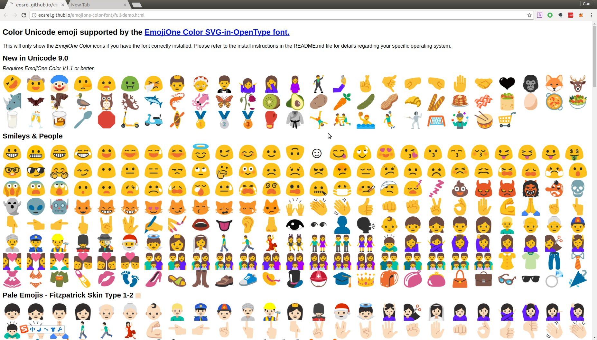
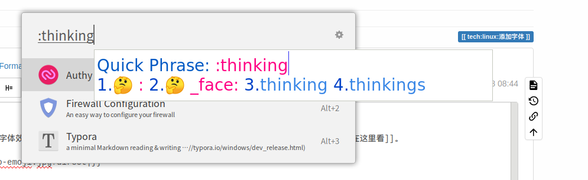

# Linux添加字体

向系统中添加字体，以可爱的果冻人emoji字体为例。

[下载NotoColorEmoji](https://noto-website.storage.googleapis.com/pkgs/NotoColorEmoji-unhinted.zip)（果冻人emoji）字体，并解压，定位到文件夹内。

```
#创建字体文件夹并拷贝字体
sudo mkdir -p /usr/share/fonts/emoji
sudo cp NotoColorEmoji.ttf /usr/share/fonts/emoji/
#赋权
sudo chmod 644 /usr/share/fonts/emoji/*.ttf
#更新索引缓存
cd /usr/share/fonts/emoji/
sudo mkfontscale && sudo mkfontdir && sudo fc-cache -fv

```

----

一般字体到这里就可以了，如果是emoji字体需要添加配置文件。

```
mkdir -p ~/.config/fontconfig/
```

```
cat << 'EOF' > ~/.config/fontconfig/fonts.conf
```

里面填入

```
<?xml version="1.0" encoding="UTF-8"?><!DOCTYPE fontconfig SYSTEM "fonts.dtd">

<match>
 <test name="family"><string>sans-serif</string></test>
 <edit name="family" mode="prepend" binding="strong">
 <string>Noto Color Emoji</string>
 </edit>
 </match>

<match>
 <test name="family"><string>serif</string></test>
 <edit name="family" mode="prepend" binding="strong">
 <string>Noto Color Emoji</string>
 </edit>
 </match>

<match>
 <test name="family"><string>Apple Color Emoji</string></test>
 <edit name="family" mode="prepend" binding="strong">
 <string>Noto Color Emoji</string>
 </edit>
 </match>
EOF
```

然后重启电脑就可以了。emoji字体效果可以[在这里看](http://eosrei.github.io/emojione-color-font/full-demo.html)。



# 添加fcitx的picker

```
sudo apt install fcitx-table-emoji
```

然后在中文输入法下，打‘；:rose:’即可输入🌹。




# 解决Thunderbird下emoji字体过大的问题
如果只安装了果冻人NotoColorEmoji并且按照上面方法配置的话，你会发现Thunderbird下的emoji变得巨大无比，甚至会把标题栏撑破。解决方法是再安装一个非彩色emoji字体，`NotoEmoji-Regular.ttf` 或者 `Symbola-emoji.tff`即可解决。

