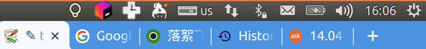

# Unity desktop 安装

在非Ubuntu的发行版安装Unity desktop environment。

## 安装

```
sudo apt update
sudo apt install ubuntu-unity-desktop
sudo apt install unity-scope-askubuntu unity-lens-applications unity-lens-files unity-greeter
```

## 解决安装后不显示状态栏：
```
sudo apt-get install --install-recommends indicator-applet-complete
```
安装后重新进入桌面：



## 解决Unity-tweak-tool缺少文件：

```
sudo apt-get install hud
```
解决com.canonical.unity.webapps is missing:

从`unity-webapps-service`中添加所需文件：

```
mkdir tweak;cd tweak
wget http://archive.ubuntu.com/ubuntu/pool/main/libu/libunity-webapps/unity-webapps-service_2.5.0~+16.04.20160201-0ubuntu1_amd64.deb
ar xvf *
tar xvf data*
sudo mv usr/share/glib-2.0/schemas/com.canonical.unity.webapps.gschema.xml /usr/share/glib-2.0/schemas/
sudo glib-compile-schemas /usr/share/glib-2.0/schemas/
cd ..; sudo rm -Rf tweak
```

参考：

[[SOLVED] Missing Schema Error In Unity Tweak Tool?](https://ubuntuforums.org/showthread.php?t=2235712)

[14.04 - Unity Tweak tool fails to start with the error &quot;com.canonical.unity.webapps schema is missing&quot; - Ask Ubuntu](https://askubuntu.com/questions/449943/unity-tweak-tool-fails-to-start-with-the-error-com-canonical-unity-webapps-sche/449956)

## HiDPI 缩放

```
sudo add-apt-repository ppa:arter97/unity
sudo apt dist-upgrade
```

参考：

[从零开始安装配置 Ubuntu Unity 18.04.2 - Plum's Blog](https://plumz.me/archives/10034/)