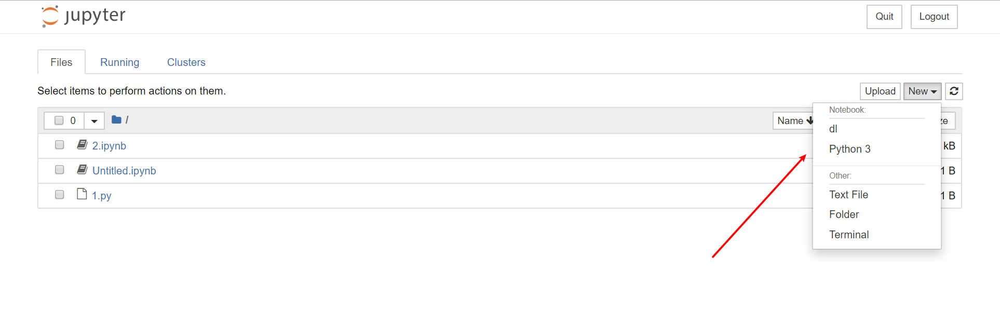

# Jupyter

## 使用Anaconda 环境

假设目前的环境名为dl


  - 进入anaconda 虚拟环境 `conda activate dl`
  - `conda install -n dl ipykernel`
  - `conda install -n dl nb_conda_kernels` # nb_conda_kernels是最简便的使用anaconda环境的方法
  - `python -m ipykernel install --user --name build_central --display-name "dl"` # 注意这里环境名要带引号

效果如下：


参考：[anaconda - Conda environments not showing up in Jupyter Notebook - Stack Overflow](https://stackoverflow.com/questions/39604271/conda-environments-not-showing-up-in-jupyter-notebook)

jupyter主页面还可以添加conda选项卡管理conda环境，需要在`base`环境下安装jupyter的包，方法参见：[ipython - In which conda environment is Jupyter executing? - Stack Overflow](https://stackoverflow.com/a/39070588/3886059)

## magic 命令

使用`%lsmagic`列出所有的magic命令。

`line magic` 以一个百分号开头，作用与一行；

`cell magic` 以两个百分号开头，作用于整个cell。

支持类似 `%ls` `%pwd` 一类基本的unix命令，`! command`来支持所有unix命令，如 `!ping wiki.luoxufeiyan.com -c 4`。

最后一行`Automagic is ON, % prefix IS NOT needed for line magics.`说明在此时即使不加上`%`也可以使用这些命令。

* 使用 whos 查看当前的变量空间

```
%whos

Variable   Type    Data/Info
----------------------------
a          int     1
b          list    n=3
```

* 使用`%reset`删除全部已分配的变量空间


参考：[lijin-THU/notes-python: 中文 Python 笔记](https://github.com/lijin-THU/notes-python)