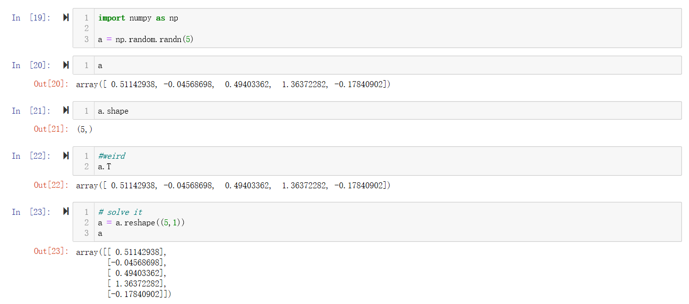

# numpy

## 避免使用秩为一的数组

eg: a.shape (5,)

这在 Python 中被称作一个一维数组。它既不是一个行向量也不是一个列向量，这也导致它有一些不是很直观的效果。例如转置矩阵结果与原来相同，内积结果为一个值等等。

解决方法：写为(5,1)的矩阵形式： `a = np.random.randn(5,1)`

不确定时用断言判断 `assert(a.shape ==(5,1))`