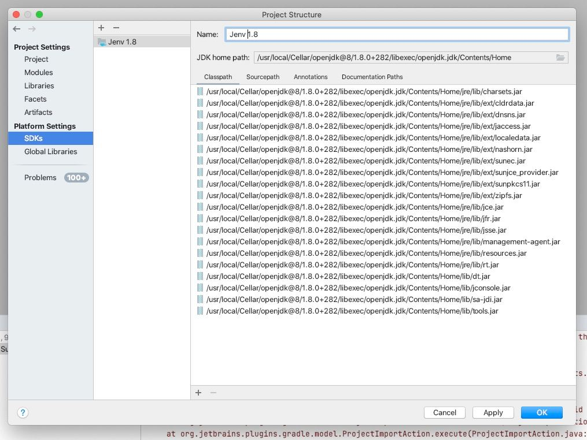

# Brew 安装 Java

使用`jenv`管理控制`Java`环境。

以 java8 为例：

```
brew install jenv openjdk@8
```

按照 brew 提示，添加 java 的运行环境和环境变量：

```
sudo ln -sfn /usr/local/opt/openjdk@8/libexec/openjdk.jdk /Library/Java/JavaVirtualMachines/openjdk-8.jdk
echo 'export PATH="/usr/local/opt/openjdk@8/bin:$PATH"' >> ~/.zshrc
export CPPFLAGS="-I/usr/local/opt/openjdk@8/include"
```

在 shell rc 中，添加 jenv 的环境变量：

```
export PATH="$HOME/.jenv/bin:$PATH"
eval "$(jenv init -)"
export JAVA_HOME="$HOME/.jenv/versions/`jenv version-name`"
```

将当前的 java 版本加入到 jenv 中：
```
jenv add /usr/local/opt/openjdk@8
```

在 idea 中添加：
```
~/.jenv/versions/11/libexec/openjdk.jdk/Contents/Home/
```



ref: [macos - How to install Java 8 on Mac - Stack Overflow](https://stackoverflow.com/questions/24342886/how-to-install-java-8-on-mac)