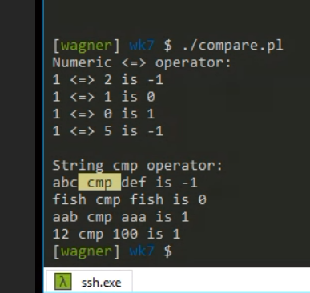

# Perl


## 数组


定义数组：

```perl
@n1=(1,5,2,3,7,9);
($q, $w, $e, $r) = @n1;
print("Numbers: @n1\n");
print("elems are: $q, $w, $e, $r\n");
```

```perl
Numbers: 1 5 2 3 7 9
elems are: 1, 5, 2, 3
```

获取长度用`$#a+1`或者`$a.""`

```perl
#!/usr/bin/perl -w

$a[0] = "My 1st string.";
$a[1] = "My 2nd string.";
$a[2] = 333;

# another way to define an array
@b = ("123", 456, "789");

# get last index of array
print("Index of last elem is:",$#a, "\n");
# get total num
print("Total elem num is: ",$#a+1, "\n");
# another way to get total num
print("Array length is: ",@a."" , "\n");

$bn = @b;
$bp = "@b";
print("b number is: ",$bn, "\n");
print("b content are: ",$bp, "\n");
```

```perl
(base) ➜  perl git:(master) ✗ perl aray_num.pl 
Index of last elem is:2
Total elem num is: 3
Array length is: 3
b number is: 3
b content are: 123 456 789
```

## 哈希

```perl
%a_hash = ('name' => 'Xin', 'age' =>22);
```

KV类型，类似python的dict，key无序。

读数据：`$a_hash{'name'}`

添加key:`$a_hash{'gender'}='F';` 类似python的`defaultdict`，可以直接对未定义的key赋值。

删除key：`delete($a_hash{'gender'});`

```perl
#!/usr/bin/perl -w

%a_hash = ('name' => 'Xin', 'age' =>22);
$a_hash{'gender'}='F';
for $key (keys %a_hash){
    print("$key is $a_hash{$key}\n");
}


(base) ➜  perl git:(master) ✗ perl hashy.pl
age is 22
name is Xin
gender is F

```

## 变量

三种数据类型：

```perl
$a_scalar = 10;
@an_array = (1, 2, 3);
$a_hash = ('name' => 'Xin', 'age' =>22);
```

Perl 只有`全局变量`, 没有局部变量。

局部变量要加`my`关键字，eg：`my $var` 才是局部变量。

### 交换两变量的值

`($a, $b) = ($b, $a);`


## 读入数据

### 从 STDIN 读入数据

```perl
#!/usr/bin/perl -w

# Read from input
$ipt = <STDIN>;
while(defined($ipt)){
    print "$ipt";
    $ipt = <STDIN>;
}

####################

while(<STDIN>){
    print $_;
}

####################

foreach $line(<STDIN>){
    print "$line";
}
```

[https://paste.ubuntu.com/p/5CKBMhTDpr/](https://paste.ubuntu.com/p/5CKBMhTDpr/)

### 从文件读入

尖括号中间是文件句柄，尖括号运算符允许你读取文件句柄，比如<STDIN>。

文件句柄需要使用尖括号包括。

```perl
#!/usr/bin/perl -w

$filename = $ARGV[0];
open(F, '<', $filename) or die $!;
# filehandle variable need angle brackets <F>
foreach $line(<F>){
    print "$line";
}
close F;
```
[https://paste.ubuntu.com/p/qWzSsqJJMj/](https://paste.ubuntu.com/p/qWzSsqJJMj/)

#### 写文件

```perl
#!/usr/bin/perl -w

$filename = 'output.txt';
@num = (1..10);

open(FR, '>', $filename) or die $!;
foreach $n(@num){
    print FR "$n\n";
}

close(FR);
```

#### <> 用法

从ARGV读入，如空，则从stdin读入。

> <> is shorthand for "read from the files specified in @ARGV, or if @ARGV is empty, then read from STDIN". 

[https://stackoverflow.com/questions/2344926/how-can-i-mix-command-line-arguments-and-filenames-for-in-perl](https://stackoverflow.com/questions/2344926/how-can-i-mix-command-line-arguments-and-filenames-for-in-perl)

## 操作

### 比较 cmp



`<=>` 比较数值

`cmp` 比较字符，比较数字时是按位比较。 eg: `12 cmp 100 is 1` (12>100)，因为按位 1 == 1, 2 >0。

`-2 <=> -3 is 1`， -2 > -3，与数学一致。

### 排序 sort

默认逐字符比较。

```perl
#!/usr/bin/perl -w
@a = ("Hangzhou Zhejiang", "Peking Beijing", "Anyang Henan", "Zhengzhou Henan", "Sydney NSW", "Zibo Shandong");

@sorted = sort @a;
print(join(', ', @sorted));


(base) ➜  perl git:(master) ✗ perl array2.pl
Anyang Henan, Hangzhou Zhejiang, Peking Beijing, Sydney NSW, Zhengzhou Henan, Zibo Shandong%  
```

根据字符长度。

```perl
@sorted = sort {length($a) cmp length($b)} @a;

(base) ➜  perl git:(master) ✗ perl array2.pl
Sydney NSW, Anyang Henan, Zibo Shandong, Peking Beijing, Zhengzhou Henan, Hangzhou Zhejiang     
```

根据省份

```perl
#!/usr/bin/perl -w
@a = ("Hangzhou Zhejiang", "Peking Beijing", "Anyang Henan", "Zhengzhou Henan", "Sydney NSW", "Zibo Shandong");

sub State{
    return (split(/ /, $_[0]))[1];
}

@sorted = sort {State($a) cmp State($b)} @a;
print(join(', ', @sorted));


(base) ➜  perl git:(master) ✗ perl array2.pl
Peking Beijing, Anyang Henan, Zhengzhou Henan, Sydney NSW, Zibo Shandong, Hangzhou Zhejiang%   
```

多条件筛选，先判断城市长度，当内容长度一样时再根据省份筛选。

`sort {length($a) cmp length($b) || State($a) cmp State($b)}`，当`length($a) cmp length($b)` 一致时返回0，随后进入or的后半条件中，不一致时（1或-1）不会判断后半`State($a) cmp State($b)`。

### 倒序排序 Reverse sort

三种方法

* 交换$a $b顺序
* 在（正序）结果前加 `-`，对结果取返
* 使用`reverse sort`

```perl
#!/usr/bin/perl -w

@a = (1,2,3,4,5,6,7);

@s1 = sort {$b <=> $a} @a;
print(join(', ', @s1));

@s2 = sort {- ($a <=> $b)} @a;
print(join(', ', @s2));

@s3 = reverse sort {$a <=> $b} @a;
print(join(', ', @s3));

(base) ➜  perl git:(master) ✗ perl reverse_sort.pl 
7, 6, 5, 4, 3, 2, 17, 6, 5, 4, 3, 2, 17, 6, 5, 4, 3, 2, 1%    
```

## 小抄速记

### 字符串转小写

lc lowercase，转小写。

```perl
#!/usr/bin/perl -w

$word="Alex";
print(lc $word);


(base) ➜  perl git:(master) ✗ perl lc.pl 
alex%               
```

### 向上、向下取整

使用`POSIX` 模块的`floor()`和`ceil()`函数。

```perl
(base) ➜  playground cat floor.pl 
#!/usr/bin/perl -w

use POSIX;

$i=23.123;

print("Result of floor is: ", floor($i), "\n");
print("Result of ceil is: ", ceil($i), "\n");


(base) ➜  playground perl floor.pl 
Result of floor is: 23
Result of ceil is: 24

```

### 文件比较

`use File::Compare;`模块的`compare()`函数，文件不同会返回`1`。

```perl
(base) ➜  playground cat compare.pl 
#!/usr/bin/perl -w
#
use File::Compare;

$f1 = $ARGV[0];
$f2 = $ARGV[1];

$ans = compare("$f1", "$f2");

print($ans);


(base) ➜  playground ./compare.pl 1.txt 2.txt 
1%                                                                              
(base) ➜  playground ./compare.pl 1.txt 1.txt 
0% 
```


### 正则匹配

#### Global matching 全局匹配

全局匹配返回一个`@array`，包括了满足条件的所有结果。

```perl
(base) ➜  playground cat regex_2.pl 
#!/usr/bin/perl -w
$str = "apple banana capsicum";

for $word ($str =~ /(\w+)/g){
    print("$word\n");    
 }


(base) ➜  playground perl regex_2.pl 
apple
banana
capsicum
```


```perl
(base) ➜  playground cat regex_3.pl 
#!/usr/bin/perl -w
$str = "apple banana capsicum";

while ($str =~ /(\w+)/g) {
    print("Word is $1, ends at position ", pos $str, "\n");
}


(base) ➜  playground perl regex_3.pl
Word is apple, ends at position 5
Word is banana, ends at position 12
Word is capsicum, ends at position 21
```

ref:

* [Perl iterate through each match](https://stackoverflow.com/questions/7580129/perl-iterate-through-each-match)
* [perlretut - perldoc.perl.org](https://perldoc.perl.org/perlretut.html#Using-regular-expressions-in-Perl)


### 字符串匹配

将`pattern`替换为`replacement`，使用 `s///`格式，其中`s///`只匹配一次，`s///g`匹配多次（全局匹配）。

`$string =~ s/pattern/replacement/g;`

Eg： 去掉字符中多余的tab和空格。

```perl
$a = "Hi \t Nih   a     \w     o"; 
$b = "HiNihao";

$a =~ s/[\t ]+//g;
```

Eg： 单次匹配与全局匹配。

```perl
$x = "I batted 4 for 4";
$x =~ s/4/four/;   # $x contains "I batted four for 4"
$x = "I batted 4 for 4";
$x =~ s/4/four/g;  # $x contains "I batted four for four"
```


#### 字符串提取

用`()`小括号标记grouped pattern，然后用`$1`提取。

```perl
$y = "'quoted words'";
$y =~ s/^'(.*)'$/$1/;  # strip single quotes,
                       # $y contains "quoted words"
```

或者在第二行使用$1接收。

```perl
$line =~ /"species": "(.*)"/)
$curr_species = $1;
```

ref:

[perlrequick - perldoc.perl.org](https://perldoc.perl.org/perlrequick.html#Search-and-replace)


#### 字符串提取为list

使用`split()`可以将字符串按条件提取为list。

用法为`split(/Pattern/, Expression)`。

```perl
$x = "Apple      Banana       Capsicum Kiwi";
@word = split /\s+/, $x; # Apple Banana Capsicum Kiwi
```

### 行内生成式

可以将`for`语句写在表达式之后，eg:

```perl
#!/usr/bin/perl -w

for (<>){
    print(join(' ', reverse split), "\n");
}
```

可以写为

```perl
#!/usr/bin/perl -w
print(join(' ', reverse split), "\n") for (<>);
```

#### 更简便的一句话写法

在`perlrun`手册中，`-p`参数可以在你的程序中假设以下循环。


```perl
#!/usr/bin/perl -w -p
$_ = join(' ', reverse split). "\n";
```

## 扩展阅读

[Perl 复习笔记(9044) - 知乎](https://zhuanlan.zhihu.com/p/191418399)