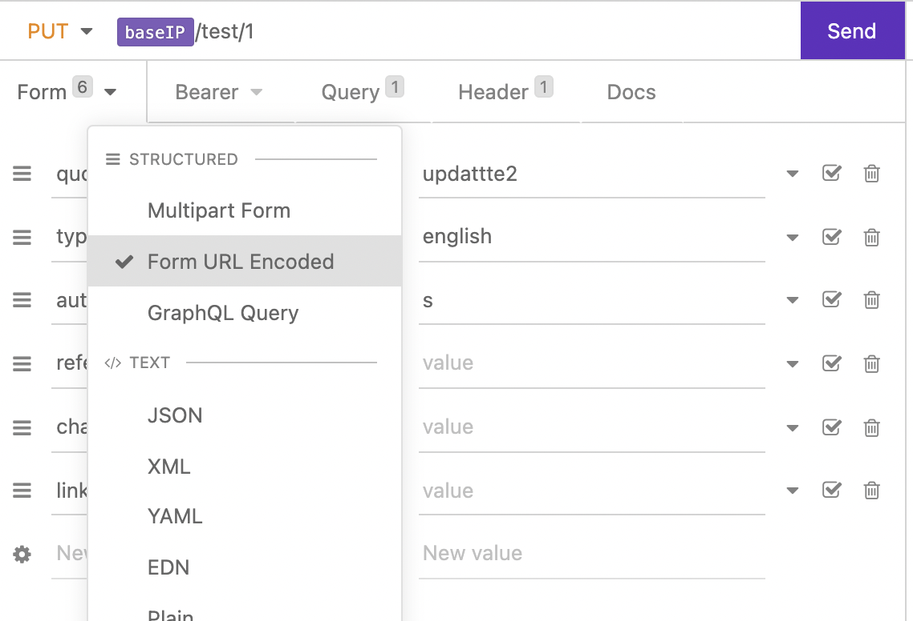

# Lumen

Lumen is a Laraverl based micro-framework.

## quicknote

serve the project: `php -S localhost:8000 -t public`

## Tips

### Make utf-8 charset for JSON response
To make charset to `utf-8` for JSON response by default, set a new `jsonResponse`
function in base controller, like:

```php
protected function jsonResponse($data, $code = 200)
{
    return response()->json($data, $code,
        ['Content-Type' => 'application/json;charset=UTF-8', 'Charset' => 'utf-8'], JSON_UNESCAPED_UNICODE);
}
```

Then for response, return `$this->jsonResponse($data);`.

source: [Laravel: Encode JSON responses in UTF-8 - Stack Overflow](https://stackoverflow.com/questions/50717005/laravel-encode-json-responses-in-utf-8)

---
### $request in PUT route does not return input data

When testing with Postman\Insomnia, Lumen cannot get inputs from a PUT method endpoint, 
the request body is null. 

Need to modify the request structure in API tool(Postman\Insomnia) to fix this issue, the request should encode in `x-www-form-urlencode`. Change the request structure in insomnia
and this should work.



#### ref
* [php - Lumen &quot;PUT&quot; request doesn&#39;t update - Stack Overflow](https://stackoverflow.com/questions/50561461/lumen-put-request-doesnt-update)
* [$request in PUT route does not return input data · Issue #630 · laravel/lumen-framework](https://github.com/laravel/lumen-framework/issues/630)


## Resources
* [👓 📚 Awesome lumen](https://github.com/unicodeveloper/awesome-lumen)

## Tutorial
* [Quickstart tutorial](https://auth0.com/blog/developing-restful-apis-with-lumen/)
* [JWT Auth tutorial](https://www.devcoons.com/getting-started-with-lumen-7-0-x-and-jwt-authentication/)
* [implement Swagger](https://developpaper.com/generation-of-swagger-documents-by-lumen-micro-services/)