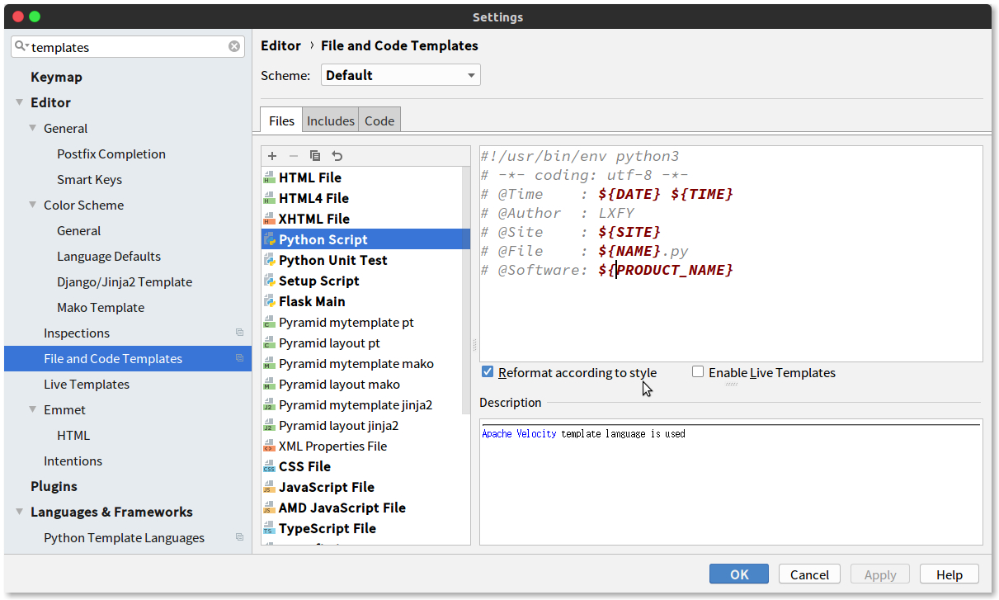

# Pycharm

## 自动添加文件头注释

Settings - Editor - File and Code Templates

```
#!/usr/bin/env python3
# -*- coding: utf-8 -*-
# @Time    : ${DATE} ${TIME}
# @Author  : LXFY
# @Site    : ${SITE}
# @File    : ${NAME}.py
# @Software: ${PRODUCT_NAME}
```


