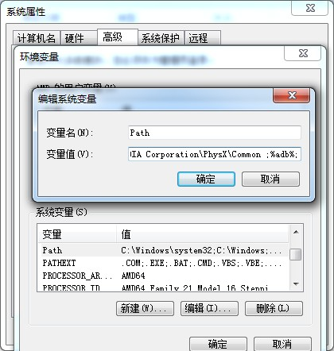

# 安装adb

每次Windows安装adb都觉得很痛苦，后来发现了`ADB Driver Installer`非常好用，记录一下安装adb的过程。

## 安装adb

下载adb：
[https://developer.android.com/studio/releases/platform-tools.html](https://developer.android.com/studio/releases/platform-tools.html)

把adb目录添加系统变量：

然后修改环境变量，在末尾加上 `;%adb%;` ，保存 ：

## 安装驱动

下载`ADB Driver Installer`，连接手机，安装驱动。

[http://adbdriver.com/downloads](http://adbdriver.com/downloads)

## 测试

命令行输入 `adb devices` 看看电脑有没有连接到设备。

