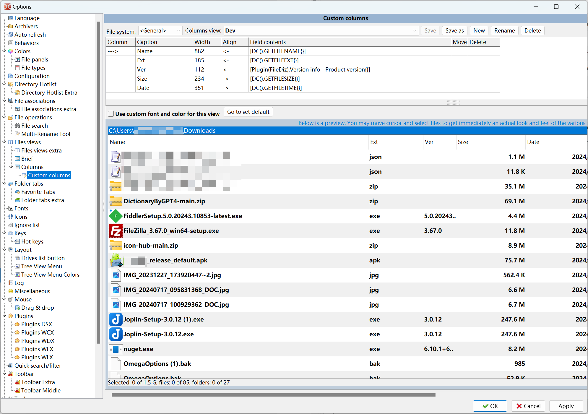

# Total Commander & Double Commander

## Plugins

- Show versions of files in a column

Download the [File descriptions 1.3.2](https://totalcmd.net/plugring/FileDiz.html) plugin, Unzipped the zip file to ..\plugins\wdx\wdx_filediz\FileDiz.wdx64

In Double Commander added the plugin in options > Plugins > tab Content plugins (.WDX).

Then go to options > Files views > Columns > Custom columns > Edit the default, and added a column.

ref: [Show versions of files in a column - Double Commander](https://doublecmd.h1n.ru/viewtopic.php?t=2575)