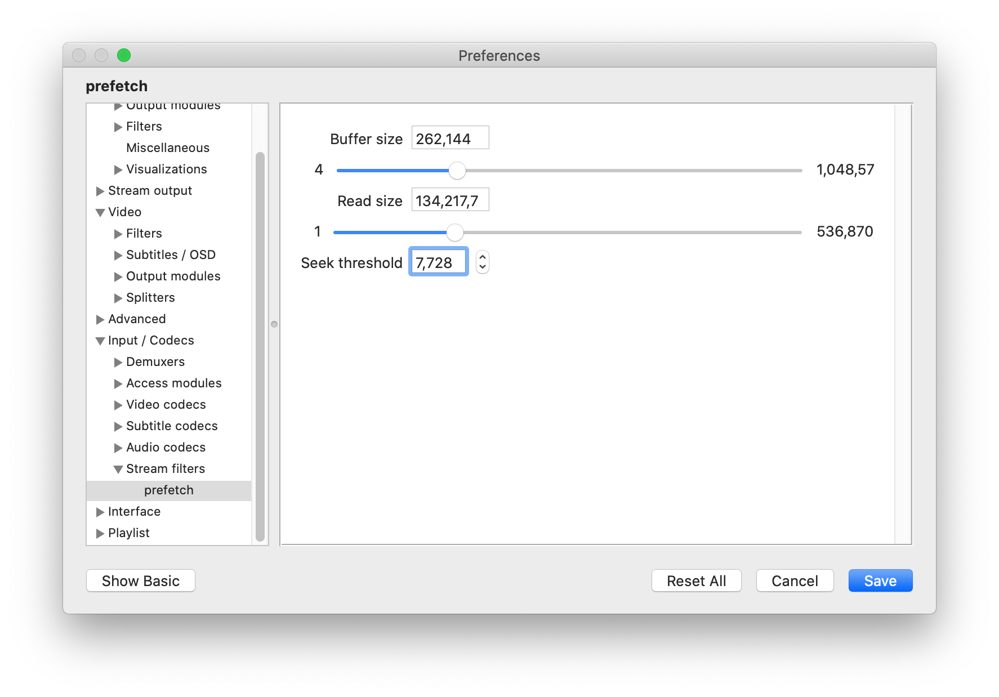

# VLC

设置 VLC 网络串流时的缓存，避免卡顿。

`Stream Output -> Stream Output Muxer Caching`

- Stream Output Muxer Caching: `5000` ms

`Input/Codec -> Stream filters -> prefetch`

- Buffer: `262144` KiB
- Read size: `134217728` bytes
- Seek threshold: `134217728` bytes

ref:

- https://www.techwalla.com/articles/how-to-change-the-buffer-on-vlc
- https://superuser.com/a/1705619
