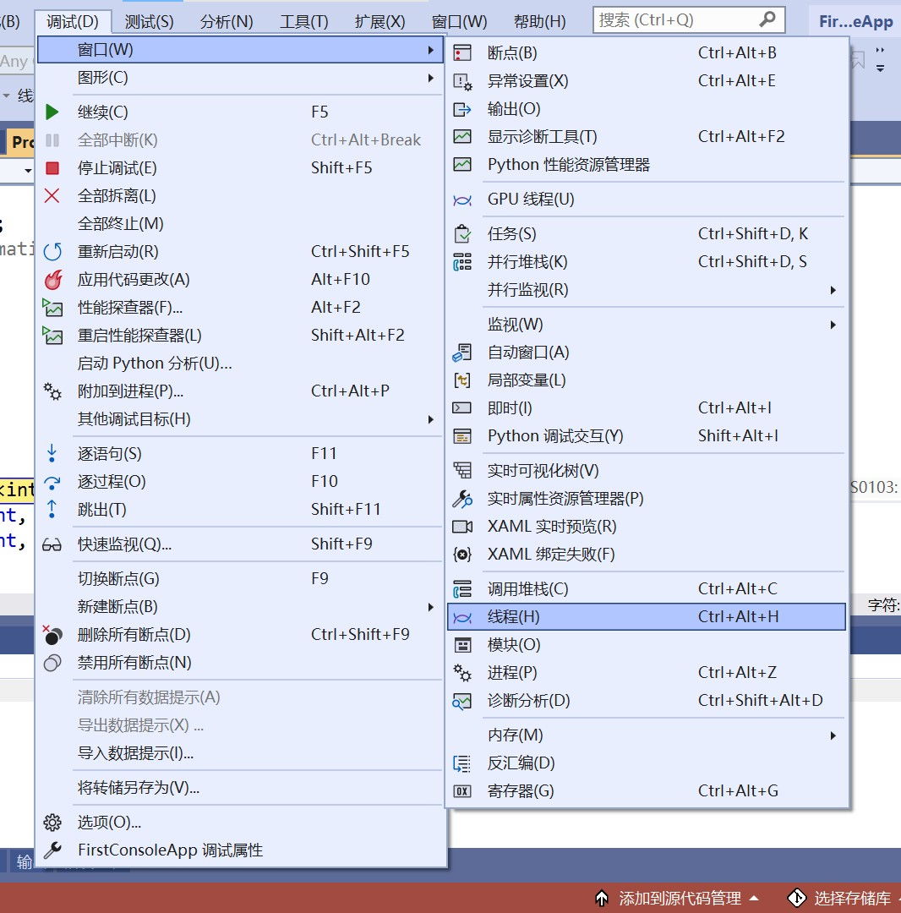

# Visual Studio

## Tips

By default, `Ctrl+N` assigns to **new File** command, which creates a new file but do not added to your project.

To make life easier, assign `Ctrl+N` to `Project.AddNewItem` command to create  **new Item** (which automatically adds it to the project).

ref: [https://weblog.west-wind.com/posts/2017/jan/25/adding-files-to-visual-studio-projects#Summary](https://weblog.west-wind.com/posts/2017/jan/25/adding-files-to-visual-studio-projects#Summary)

## shortcut

`Ctrl+M Ctrl+O` expand all functions

`Ctrl+M Ctrl+L` collapse all functions

## Plugins

* format code on save: [Code Cleanup On Save - Visual Studio Marketplace](https://marketplace.visualstudio.com/items?itemName=MadsKristensen.CodeCleanupOnSave)

* create new file

## 单线程调试方法

在调试-线程中，全选并冻结所有线程，然后只对一个线程解封。