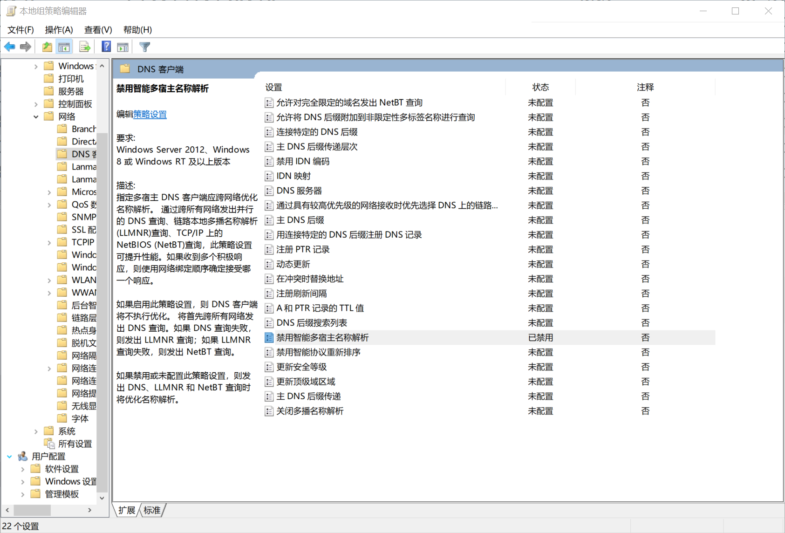

# Windows

### 备份及恢复本机的IP信息

  * 备份本机的IP信息： `netsh -c interface dump > network_config.txt`
  * 恢复本机的IP信息： `netsh -f network_config.txt` 或者（`netsh -c Interface -f network_config.txt`）

ref:

* https://superuser.com/questions/573739/netsh-import-doesnt-work

## 常用软件：
  * [AnyTXT：搜索文件内的关键字](https://anytxt.net/)
  * [DriverPack: 驱动下载](https://driverpack.io/en)
  * [Taskbar stats](https://github.com/openhoangnc/taskbar-stats/)
  * [RidNacs: 分析文件体积的绿色软件](https://www.splashsoft.de/ridnacs-disk-space-usage-analyzer/)
  * [SpaceSniffer： 分析文件体积](http://www.uderzo.it/main_products/space_sniffer/)
  * [Process Explorer：进程浏览器，可以查看进程线程与通信端口等](https://learn.microsoft.com/en-us/sysinternals/downloads/process-explorer)
  * [Sumatra PDF: PDF阅读器](https://www.sumatrapdfreader.org/free-pdf-reader.html)

## 常见问题
  * [关闭恼人的“发送至Onenote工具”](https://superuser.com/questions/662737/how-to-stop-send-to-onenote-window-from-showing-when-i-start-onenote-2013)

  ## DNS

  ### 智能多宿主名称解析

  Windows8+ 中，默认启动了智能多宿主名称解析，会将DNS请求向本机所有的网络接口发送，在爱网上网时，可能会造成DNS泄露。

  

  可以通过以下方式禁用：
  组策略编辑器中，启用 计算机配置->管理模板->网络->DNS客户端->禁用智能多宿主名称解析

  ref:
  * https://www.ghacks.net/2017/08/14/turn-off-smart-multi-homed-name-resolution-in-windows/
  * https://github.com/Dreamacro/clash/issues/2136
